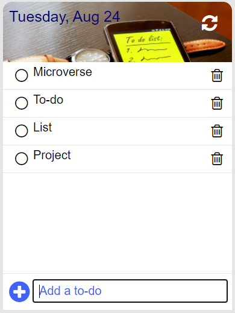

# Todo-list

> In this project we're challenged to create a todo-list, that has functions of adding and removing tasks and a drag-drop feature that can re-order the tasks and as optional personalize the styling for the list.;

Additional description about the project and its features.

## Built With

- Js
- Html
- Css

## Live Demo

[Live Demo Link](https://leonardoeng13.github.io/todo-list/src/index.html)

## Getting Started

To get a local copy up and running follow these simple example steps.

###Prerequisites

- Git/GitHub;
- Optional ( IDE installed in your machine ) - recommended IDE: Vscode;
- Node installed locally;

## Setup

- To clone this repo:
    - Open the Terminal(Mac/Linux) or the Cmd (Windows);
    - Navigate to where you want to paste the Repo folder;
    - Type git clone https://github.com/leonardoeng13/todo-list.git;
    - Open the folder todo-list that was created on your IDE;

## Install

- To install all the dependencies in the package-lock.json:
    - Open the Terminal(Mac/Linux) or the Cmd (Windows);
    - Navigate to be inside the todo-list repo folder;
    - Run npm install or npm i;

## Run tests

- Linters Tests:
    - Eslint: run npx eslint .
    - Stylelint: run npx stylelint "**/*.{css,scss}"
    - WebHint: run npx hint --telemetry=off .
    - LightHouse: run lhci autorun --upload.target=temporary-public-storage --collect.staticDistDir=.
- Run a Live Version of the Dist Folder:
    - Run npm start
- To build the webpack:
    - Run npm run build

## Authors

👤 **Leonardo de Andrade**

- GitHub: [@leonardoeng13](https://github.com/leonardoeng13)
- Twitter: [@Leo Andrade](https://twitter.com/deandrede_leo)
- LinkedIn: [LinkedIn](https://www.linkedin.com/in/leonardodeandrade/)

## 🤝 Contributing

Contributions, issues, and feature requests are welcome!

Feel free to check the [issues page](https://github.com/leonardoeng13/todo-list/issues).

## Show your support

Give a ⭐️ if you like this project!

## 📝 License

This project is [MIT](./MIT.md) licensed.
